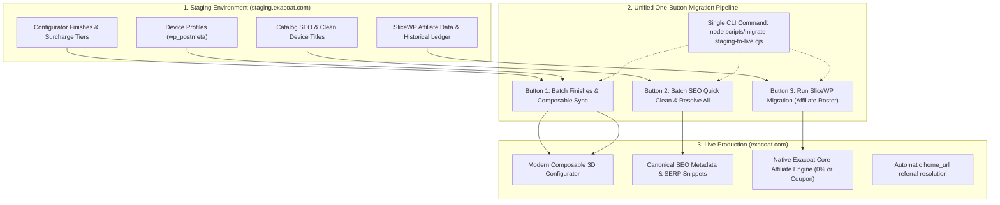

# Migration Guide: Staging (staging.exacoat.com) to Production (exacoat.com)

This document outlines the step-by-step procedure to migrate configurator data, global texture finishes, product SEO metadata, affiliate creator programs, and app connections from the staging environment to the live production store.

---

## 1. System Overview & Architecture

Configurator setups, materials, affiliate ledgers, and storefront metadata are distributed across five distinct layers:

1. **WordPress Database (Staging vs Production):**
   - **Global Finishes & Materials:** Stored in `wp_options` under:
     - `exacoat_global_finishes` (all textures, albedo maps, normal maps, roughness, active/stock flags)
     - `exacoat_global_finish_groups` & `exacoat_finish_group_settings` (group ordering and presentation)
     - `exacoat_finish_surcharge_tiers` (premium tier pricing)
     - `exacoat_configurator_presets` (popular curated setups)
     - `exacoat_addon_schemas` (hardware/skin add-ons)
   - **Device Configurator Profiles:** Stored in `wp_postmeta` under meta key `_exacoat_configurator_profile` on each WooCommerce product (layers, mask PNGs, scales, offsets, camera plateau setups, 360 cuts).
2. **Product SEO & Storefront Copywriting Layer:**
   - **WooCommerce Short Descriptions:** Stored in `wp_posts.post_excerpt` (storefront product overview).
   - **Yoast SEO Metadata:** Stored in `wp_postmeta` under keys `_yoast_wpseo_title`, `_yoast_wpseo_metadesc`, `_yoast_wpseo_focuskw`.
   - **Rank Math Metadata:** Stored in `wp_postmeta` under keys `rank_math_title`, `rank_math_description`, `rank_math_focus_keyword`.
   - **Device Name Normalization:** Eliminates redundant titles like `iPhone 18 Pro Skins Skin & Wrap | Exacoat` by normalizing `iPhone 18 Pro Skins` to `iPhone 18 Pro Skin & Wrap | Exacoat`.
   - **Boilerplate Resolution Engine:** Automatically strips raw HTML tags (`<a href="[geturl]">`, `<em>`), resolves `[product_name]` shortcodes, and replaces em dashes with clean punctuation.
3. **Affiliate & Creator Program Layer (SliceWP to Native Exacoat Core):**
   - **Affiliates Registry (`wp_exacoat_affiliates`):** All 77+ creators, custom referral slugs (`@edwinyg`, `@ds`, `@suns`, `@putra`), custom commission rates, customer discount percentages (15%, 10%, 0%), bank payout accounts (BCA, Mandiri), and lifecycle status.
   - **Commissions Ledger (`wp_exacoat_affiliate_commissions`):** Complete historical ledger of 882+ commissions verified against WooCommerce order totals, maturation status (7-day post-delivery grace period), and exact unpaid balances.
   - **Referral Clicks (`wp_exacoat_affiliate_clicks`):** 22,900+ logged visitor click events with cookie attribution metadata.
   - **Payouts (`wp_exacoat_affiliate_payouts`):** Historical and pending bank disbursement records.
   - **Configuration Options (`wp_options`):** `exacoat_affiliate_settings`, `exacoat_affiliate_recalc_v98`.
   - **Dynamic Domain Resolution:** Referral links use dynamic `home_url('/')` resolution (`$referral_url = trailingslashit( $site_url ) . '?x=' . rawurlencode( $affiliate->slug );`), meaning links automatically point to `https://exacoat.com/?x={slug}` on production without code changes.
4. **Media Storage (`/wp-content/uploads/`):**
   - All uploaded texture image files, bump maps, normal maps, and device cut mask PNGs reside in WordPress uploads.
5. **Exacoat Manager ERP (React / Vite):**
   - Connects to WordPress via REST API endpoints (`/wp-json/wc/v3` and `/wp-json/exacoat-core/v1`).
   - Resolves target URL via `localStorage`, `.env` (`VITE_WORDPRESS_URL`), and internal fallbacks.

---

## 2. Six-Step Migration Procedure

### Step 1: Synchronize Media Uploads (`/wp-content/uploads/`)
Before switching data or endpoints, ensure all assets referenced by the configurator exist on the production server:
- Copy new texture image files (thumbnails, high-res texture maps, normal maps) and device mask PNGs from `staging.exacoat.com/wp-content/uploads/` to `exacoat.com/wp-content/uploads/`.
- Tools: SFTP / rsync / hosting control panel file manager / WordPress media sync plugin.
- Note: If both staging and production share a common CDN or media bucket, verify that files uploaded during staging configuration are publicly accessible on the production domain.

---

### Step 2: Migrate Configurator Data from Staging to Production

Do not simply change the URL in the app without migrating the data first, or production will show empty or outdated texture lists.

#### Method A: Automated Sync via REST API (Recommended)
You can run an automated sync script using the `exacoat-core` REST API bridge:
1. **Fetch from Staging:**
   - Finishes, groups, settings, presets: `GET https://staging.exacoat.com/wp-json/exacoat-core/v1/finishes`
   - Surcharge tiers: `GET https://staging.exacoat.com/wp-json/exacoat-core/v1/configurator/surcharge-tiers`
   - Device profiles: `GET https://staging.exacoat.com/wp-json/exacoat-core/v1/configurator/profiles?per_page=500`
2. **Transform URLs:**
   - Search and replace `https://staging.exacoat.com` with `https://exacoat.com` inside all texture big URLs, thumbnails, normal maps, and layer mask URLs.
3. **Push to Production:**
   - Batch save finishes and groups: `POST https://exacoat.com/wp-json/exacoat-core/v1/finishes/save-all`
   - Save surcharge tiers: `POST https://exacoat.com/wp-json/exacoat-core/v1/configurator/surcharge-tiers`
   - Save each device profile: `POST https://exacoat.com/wp-json/exacoat-core/v1/configurator/save` (authenticated with production WooCommerce Consumer Key & Secret).

#### Method B: Database Export / Better Search Replace
If performing database-level export:
1. Export the `wp_options` records listed in Section 1.
2. Export all `wp_postmeta` records where `meta_key = '_exacoat_configurator_profile'`.
3. Import into the production database.
4. Run **Better Search Replace** plugin (or `wp search-replace` via WP-CLI) on `wp_options` and `wp_postmeta` to replace `https://staging.exacoat.com` with `https://exacoat.com`.

---

### Step 3: Product SEO, Copywriting & Boilerplate Resolution (Batch SEO Optimizer)

Most staging and imported products share an identical boilerplate template in WooCommerce:
> *"Let's get one thing straight, your `<a href="[geturl]">[product_name]</a>` is cool... Wrap your `[product_name]` with Exacoat's premium skin, no added bulk..."*

This creates duplicate content penalties, unparsed shortcodes in Google search previews, and redundant title text like `iPhone 18 Pro Skins Skin & Wrap | Exacoat`.

To optimize your catalog before or after pushing to production, use the **Batch SEO Optimizer** inside Exacoat Manager:

#### Method A: Direct Batch SEO Optimizer (Recommended)
1. In Exacoat Manager, navigate to **Products Hub** (`/products`).
2. Select the **Exacoat Webstore** tab.
3. In the top amber banner, click **Batch SEO Optimizer**.
4. **Tab 1: Quick Clean & Resolve All**:
   - One click iterates through every product in the catalog.
   - Resolves `[product_name]` into each device's clean name (e.g. `iPhone 18 Pro`, `MacBook Pro 16 M3`).
   - Normalizes redundant titles to canonical `${cleanDevice} Skin & Wrap | Exacoat` (stripping redundant `Skins Skin & Wrap`).
   - Sets canonical focus keywords (`${cleanDevice.toLowerCase()} skin`).
   - Strips raw HTML tags, removes `[geturl]`, and replaces all em dashes with commas.
   - Updates WooCommerce `post_excerpt`, Yoast SEO (`_yoast_wpseo_*`), and Rank Math (`rank_math_*`) simultaneously.
5. **Tab 2: AI Batch Differentiation**:
   - Optionally run AI generation (Google Gemini or OpenAI) to generate distinct, authentic 3M-focused copy tailored to each specific device model.

#### Method B: JSON Snapshot Export & Import (Staging to Production Sync)
If staging and production databases are maintained separately:
1. On Staging Exacoat Manager:
   - Open **Batch SEO Optimizer** -> **3. Staging to Production Migration** tab.
   - Click **Export SEO Catalog (JSON)** to download `exacoat-seo-catalog-YYYY-MM-DD.json`.
2. On Production Exacoat Manager:
   - Switch your target environment to Production (`https://exacoat.com`).
   - Open **Batch SEO Optimizer** -> **3. Staging to Production Migration** tab.
   - Click **Import SEO Catalog (JSON)** and select the downloaded file.
   - Exacoat Manager will match each product by SKU and slug, updating all SEO titles, descriptions, and keywords in seconds.

#### Method C: Direct Database Migration (Automatic)
If you migrate the entire database using WP Migrate DB, All-in-One WP Migration, or standard MySQL dump:
- All updated SEO metadata in `wp_posts.post_excerpt` and `wp_postmeta` (`_yoast_wpseo_*`, `rank_math_*`) transfers automatically to production without manual export/import.

---

### Step 4: Affiliate & Creator Program Migration (SliceWP to Native Exacoat Core)

The affiliate system transitions seamlessly from legacy SliceWP to Exacoat Core native architecture.

#### Method A: One-Button SliceWP Migration via Manager UI (Recommended)
1. Open Exacoat Manager and navigate to **Affiliate & Creator Program** (`/affiliates`).
2. Select the **SliceWP Migration** tab.
3. Review the live pre-migration audit numbers:
   - Active Creators (77)
   - Total Commissions (882)
   - Unpaid Balance audit total
   - Visits & Clicks Tracked (22,900+)
4. Click the single button: **Run SliceWP Migration**.
5. The migration runs server-side via REST API:
   - Transfers all creators without changing their user roles or permissions.
   - Preserves custom slugs (`edwinyg`, `ds`, `suns`, `putra`).
   - Retains genuine customer discount coupons (`edwin15` 15%, `ds10` 10%, `suns10` 10%, `putra10` 10%).
   - Configures non-coupon creators to 0% customer discount links so they retain their full commission.
   - Preserves BCA and Mandiri bank destination accounts.
   - Fully idempotent: safe to run multiple times without duplicating commissions or clicks.

#### Method B: Direct REST API Execution
Run an authenticated POST request against the production store:
```bash
POST https://exacoat.com/wp-json/exacoat-core/v1/affiliate/admin/slicewp-migrate
Headers: Authorization: Basic <base64(consumer_key:consumer_secret)>
```

#### Method C: Database-Level Migration (Auto-Continuation)
If you clone or export the staging database to production:
- The 4 custom tables (`wp_exacoat_affiliates`, `wp_exacoat_affiliate_commissions`, `wp_exacoat_affiliate_clicks`, `wp_exacoat_affiliate_payouts`) and `wp_options` records automatically transfer to production.
- Because referral links resolve via WordPress `home_url('/')`, all referral URLs automatically point to `https://exacoat.com/?x={slug}` with zero manual reconfiguration.
- SliceWP can be completely deactivated on production once verified.

---

### Step 5: Deploy Plugin and Configure Production API Keys

1. **Package Latest Plugin:**
   In `exacoat-manager`, run:
   ```bash
   node scripts/package-plugin.cjs
   ```
   This generates the current release ZIP at `public/exacoat-core.zip` and `public/exacoat-core-v0.1.99.zip`.
2. **Update Plugin on Production:**
   - Go to `exacoat.com` WP Admin -> Plugins -> Add New -> Upload Plugin.
   - Upload and replace the existing `exacoat-core` plugin.
3. **Generate REST API Credentials:**
   - Go to `exacoat.com` WP Admin -> WooCommerce -> Settings -> Advanced -> REST API.
   - Click **Add Key**.
   - Description: `Exacoat Manager Production`.
   - User: Administrator account.
   - Permissions: **Read/Write**.
   - Copy the **Consumer Key** (`ck_...`) and **Consumer Secret** (`cs_...`).

---

### Step 6: Update Exacoat Manager Configuration

1. **Update `.env` file:**
   ```env
   VITE_APP_NAME="Exacoat Manager"
   VITE_WORDPRESS_URL=https://exacoat.com
   VITE_WC_CONSUMER_KEY=ck_production_key_here
   VITE_WC_CONSUMER_SECRET=cs_production_secret_here
   VITE_ADMIN_EMAIL=admin@exacoat.com
   ```

2. **Update Code Fallbacks:**
   - `src/lib/env.ts`: Update default fallback from `https://staging.exacoat.com` to `https://exacoat.com`.
   - `vite.config.ts`: Update local proxy target fallback to `https://exacoat.com`.
   - `src/lib/imageLoader.ts`: Set fallback proxy origin to `https://exacoat.com`.

3. **Reset In-Browser LocalStorage:**
   - Open Exacoat Manager in your browser.
   - Navigate to **Settings** -> **WordPress API & Bridge**.
   - Click the preset button **exacoat.com (live)** or click **Reset Default** to clear cached staging URLs from `localStorage`.
   - Verify that your production WooCommerce Consumer Key and Secret are filled in.

---

## 3. The Unified "One-Button Migration" Architecture

To eliminate human error and make staging-to-production migration turn-key, Exacoat Manager provides three modular one-button execution surfaces and an all-in-one CLI runner:



### Module 1: One-Click Configurator Batch Migration
- **Location:** Configurator Studio -> Overview / Settings.
- **Action:** Click **Auto-Migrate All Products**.
- **Operation:** Calls `/configurator/batch-migrate` to convert legacy MKL configurations to composable profiles in a single pass.

### Module 2: One-Click Catalog SEO & Copywriting Resolution
- **Location:** Products Hub -> Exacoat Webstore -> Batch SEO Optimizer.
- **Action:** Click **Quick Clean & Resolve All**.
- **Operation:** Resolves all `[product_name]` shortcodes, canonicalizes titles to `${cleanDevice} Skin & Wrap | Exacoat`, removes `[geturl]`, and strips raw HTML across all products in one click.

### Module 3: One-Click Affiliate & Creator Migration
- **Location:** Affiliate & Creator Program -> SliceWP Migration.
- **Action:** Click **Run SliceWP Migration**.
- **Operation:** Calls `/affiliate/admin/slicewp-migrate` to import all 77 creators, 882 commissions, 22,900+ clicks, and payout destinations in one click.

### Single-Command Automated Pipeline
If you prefer running the full migration directly via terminal:
```bash
node scripts/migrate-staging-to-live.cjs
```
This script sequentially executes:
1. Configurator finishes & surcharge tiers extraction, domain URL transformation, and production push.
2. SliceWP affiliate program migration and balance verification.
3. Composable configurator batch product migration.

---

## 4. Post-Migration Verification Checklist

- [ ] **Materials Inventory:** Open Materials Stock page in Exacoat Manager. Verify all configured textures (concrete, camo, colors) appear with correct stock and active toggles.
- [ ] **Configurator Studio:** Open a device in Configurator Studio. Check that 3D preview loads, masks render properly, and texture scaling is preserved.
- [ ] **SEO & SERP Snippet Verification:** Open Products Hub -> Exacoat Webstore. Open the "SEO & Copy" modal on 2-3 devices (e.g. iPhone, MacBook). Verify that the Google search result preview renders clean device text without raw HTML tags, without `[product_name]` shortcodes, and without redundant "Skins Skin & Wrap" in the title.
- [ ] **Catalog Uniformity:** In the Batch SEO Optimizer, verify that 0 products remain with boilerplate tokens or raw HTML.
- [ ] **Affiliate Roster & Slugs:** Open Affiliate & Creator Program in Exacoat Manager. Verify all active creators appear with their custom slugs (`@edwinyg`, `@ds`, `@suns`, `@putra`) and correct commission rates.
- [ ] **Unpaid Balances Integrity:** Verify exact unpaid balances match audit ledger (Edwin Yang IDR 1.258.826, Dimas Sampurno IDR 4.159.681, Suns Channel IDR 1.157.060, Putra S IDR 578.435).
- [ ] **Customer Discount Rates:** Confirm Edwin (15%), Dimas (10%), Suns (10%), Putra (10%) have customer discount badges; verify other creators are set to 0% Off Link.
- [ ] **Referral Link Resolution:** Verify referral link generation on `exacoat.com` resolves to `https://exacoat.com/?x={slug}` and captures `exacoat_aff_ref` cookie upon visit.
- [ ] **Creator Workstation:** Open "See as Creator" modal and verify portal workstation loads metrics and daily charts.
- [ ] **Orders & RMA:** Open Orders view. Verify live orders load without REST API authentication errors. Test opening Manual Warranty / Redeem modal.
- [ ] **Image Proxy:** Test opening a product item preview or generating a composite thumbnail to confirm CORS and proxy headers function properly on `exacoat.com`.
